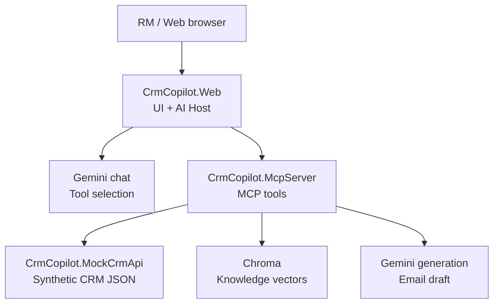
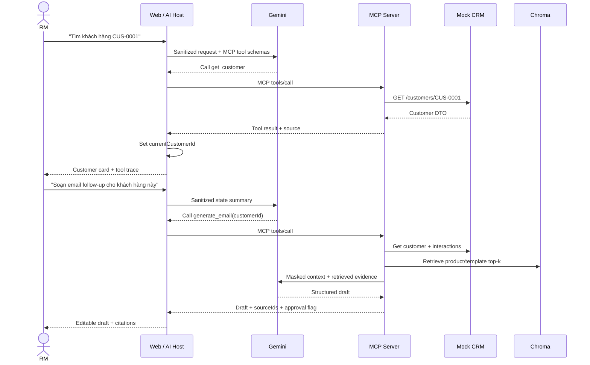
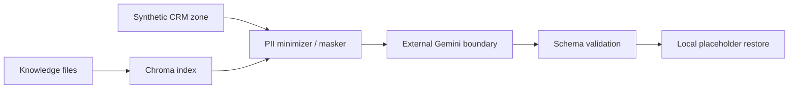

# 02 — Architecture

## 1. Kiến trúc mục tiêu P0



Ranh giới quan trọng:

- `CrmCopilot.Web` là **MCP Host** và chứa **MCP Client**.
- `CrmCopilot.McpServer` expose capability. Nó không phải conversation database.
- Mock CRM API phục vụ dữ liệu có cấu trúc; Chroma phục vụ semantic retrieval.
- Gemini chỉ nhận context đã giảm thiểu và mask.

## 2. Solution structure đề xuất

```text
CrmCopilot/
├── CrmCopilot.slnx
├── CLAUDE.md
├── README.md
├── compose.yaml                  # đã thêm ở P0-09 Pha B (4 service + job ingest)
├── .env.example
├── docs/
├── data/
│   ├── crm/
│   │   ├── customers.json
│   │   ├── interactions.json
│   │   ├── opportunities.json    # P1-ready, không bắt buộc core flow
│   │   └── campaigns.json        # P2-ready
│   └── knowledge/
│       ├── products.json
│       └── email-templates.json
├── src/
│   ├── CrmCopilot.Web/
│   ├── CrmCopilot.McpServer/
│   ├── CrmCopilot.MockCrmApi/
│   └── CrmCopilot.Contracts/
└── tests/
    └── CrmCopilot.Tests/
```

Không tách thêm class library cho từng feature trong P0. Trong mỗi project dùng feature folders để tránh solution phình to.

## 3. Trách nhiệm thành phần

| Thành phần | Trách nhiệm | Không chịu trách nhiệm |
| --- | --- | --- |
| Web / AI Host | UI, session ID, sanitized conversation state, Gemini tool loop, MCP Client, hiển thị trace/source | Đọc JSON CRM trực tiếp; query Chroma trực tiếp |
| MCP Server | Tool contracts, validation, CRM gateway, RAG orchestration, masking, email generation | Lưu lịch sử chat dài hạn; render UI |
| Mock CRM API | REST API deterministic trên synthetic JSON | LLM, semantic search, state |
| Chroma | Index vectors và metadata của product/template | Customer/interaction, chat history, audit log |
| Gemini | Tool selection và sinh email theo context được cấp | Source of truth; tự truy cập CRM |
| Contracts | DTO, result/error codes chia sẻ | Infrastructure implementation |

## 4. Luồng hội thoại và tool calling



## 5. Gemini orchestration

AI Host dùng Gemini function calling để chọn tool từ danh sách MCP được discover. Vòng lặp bị giới hạn:

1. User message được sanitize và ghép với state summary.
2. Gemini chọn tool hoặc trả lời rằng cần làm rõ.
3. Host gọi tool qua MCP Client.
4. Tool result được đưa lại model nếu cần diễn đạt, hoặc render trực tiếp nếu đã có DTO phù hợp.
5. Tối đa **3 tool calls/user turn** trong P0 để tránh loop.
6. Nếu model yêu cầu tool ngoài allowlist hoặc lặp cùng arguments, Host dừng với lỗi có kiểm soát.

Đối với `generate_email`, MCP Server chịu trách nhiệm pipeline RAG + generation để contract có thể tái sử dụng bởi host khác.

## 6. Conversation state

Conversation state là bộ nhớ tác vụ ngắn hạn, không chỉ là transcript.

```csharp
ConversationState
- SessionId
- CurrentCustomerId
- CurrentOpportunityId          // nullable, dành cho P1
- LastIntent
- LastInteractionIds
- RetrievedSourceIds
- PendingEmailDraftId
- RecentSanitizedMessages       // tối đa 8 message
- UpdatedAtUtc
```

Quy tắc:

- Lưu trong `IConversationStateStore`, P0 implementation bằng `ConcurrentDictionary`.
- Browser tạo `sessionId` và gửi cùng mỗi request.
- Server chỉ giữ entity IDs, intent summary và message đã sanitize; không giữ raw phone/email/account.
- MCP Server nhận `customerId` explicit trong tool arguments và giữ stateless.
- Restart làm mất state là giới hạn được chấp nhận cho MVP.
- Nếu câu “khách hàng này” xuất hiện khi không có `CurrentCustomerId`, Host phải hỏi làm rõ thay vì đoán.

## 7. Data ownership và retrieval

| Dữ liệu | Nơi lưu | Cách lấy | Citation/source |
| --- | --- | --- | --- |
| Customer | JSON qua Mock CRM API | Exact/filter lookup | `crm:customer:<id>` |
| Interaction | JSON qua Mock CRM API | Filter customer ID, sort UTC desc | `crm:interaction:<id>` |
| Product | JSON + Chroma index | Semantic top-k + metadata filter | `kb:product:<code>` |
| Email template | JSON + Chroma index | Semantic top-k | `kb:email-template:<id>` |
| Conversation state | Host memory | session key | Không phải citation |
| Audit event | Structured log | correlation ID | `traceId` |

Structured CRM lookup không được gọi là vector RAG. RAG trong demo phải thể hiện rõ bước embedding query → Chroma retrieval → grounded generation.

## 8. Security/trust boundaries



- Chỉ dùng dữ liệu tổng hợp trong P0.
- Dù là dữ liệu tổng hợp, pipeline vẫn mask như production pattern.
- Prompt/log không chứa API key, raw email/phone/account/CCCD/address.
- Tool result về UI có thể chứa synthetic profile để demo; payload gửi Gemini phải tối thiểu.
- Retrieved knowledge là untrusted text: bao trong data delimiters và yêu cầu model bỏ qua instruction bên trong.
- Email draft cần human approval và không tạo side effect.

## 9. Failure handling

| Lỗi | Hành vi P0 |
| --- | --- |
| Customer không tồn tại | Trả `NOT_FOUND`, không gọi Gemini để bịa |
| Trùng tên | Trả danh sách candidate tối thiểu, yêu cầu chọn ID |
| Mock CRM timeout/5xx | Trả `UPSTREAM_UNAVAILABLE` + correlation ID |
| Chroma unavailable | Không sinh email grounded; trả lỗi retryable |
| Gemini quota/timeout | Trả lỗi rõ, không thay bằng template giả mà không báo |
| Output sai schema | Retry tối đa 1 lần với schema reminder; sau đó fail controlled |
| Không có retrieval đủ liên quan | Trả “không tìm thấy knowledge phù hợp”; không bịa product |
| Tool loop | Dừng sau 3 calls, ghi audit event |

## 10. Local, Docker và cloud

### Local-first P0

- Chạy 3 process .NET và một Chroma container.
- Config endpoint qua environment/options, không hard-code localhost trong domain logic.
- Health endpoint cho Web, MCP, Mock CRM; heartbeat cho Chroma.

### Docker bonus

Khi P0 local pass, có thể thêm Dockerfile cho ba service và `compose.yaml`. Chroma là service thứ tư với persistent volume. Không coi Docker là pass condition của core MVP.

**Đã triển khai (P0-09 Pha B).** `compose.yaml` ở repo root dựng bốn service — `web`, `mcpserver`, `mockcrmapi`, `chroma` — cộng một job `ingest` chạy một lần, đặt sau profile `ingest` để `up` thường ngày không tốn Gemini API call. Mỗi service .NET có multi-stage Dockerfile riêng trong thư mục project của nó, chạy non-root (`APP_UID=1654`), build context là repo root vì csproj glob vào `data/`. Service-to-service dùng compose service name (`http://mockcrmapi:8080`, `http://chroma:8000`, `http://mcpserver:8080`), không dùng `localhost`. Port phía host giữ nguyên `5081/5090/5100/8000` nên preflight ở `docs/11_DEMO_RUNBOOK.md` chạy không cần sửa. `GEMINI_API_KEY` chỉ inject lúc runtime, không bake vào image. Chi tiết vận hành ở README §9B; Docker vẫn **không** phải pass condition của core MVP.

### Cloud tối giản

Một host/container platform chạy Web, MCP Server, Mock CRM API; Chroma chạy container có volume hoặc dịch vụ riêng. Cấu trúc HTTP-based này cho phép deploy mà không đổi application contract. Auth, TLS termination, secret manager và persistent session store là hạng mục sau MVP.

