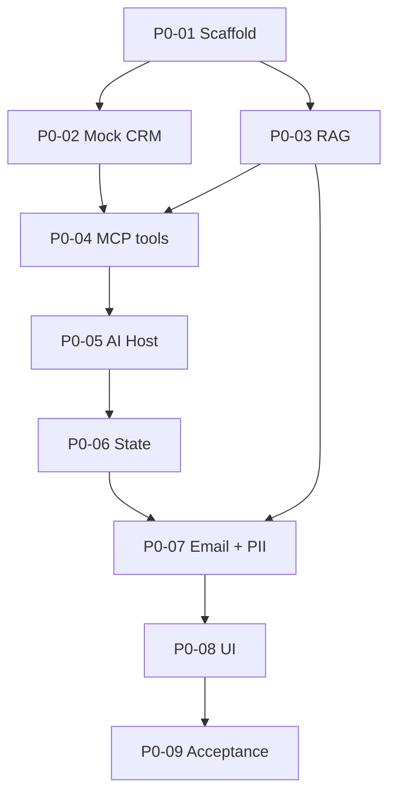

# 05 — Implementation Plan (9 Days)

## 1. Chiến lược

- Local-first, vertical slice sớm.
- Mỗi ngày tối đa một checkpoint chính và một buffer nhỏ.
- Ngày 5 phải có natural language → Gemini → MCP → CRM chạy được.
- Ngày 7 phải có email RAG + PII.
- Ngày 8 dành cho UI tích hợp, ngày 9 chỉ hardening/demo.
- Nếu mất một ngày, cắt bonus trước, không cắt core flow.

## 2. Lịch 9 ngày

| Ngày | Checkpoint | Mục tiêu cuối ngày | Review gate |
| --- | --- | --- | --- |
| Day 1 | P0-01 | Solution build, health endpoints, config/package pin | Build sạch; boundary đúng |
| Day 2 | P0-02 | Dataset + Mock CRM + gateway + tests | Customer/interaction deterministic |
| Day 3 | P0-03 | Chroma ingestion/retrieval bằng Gemini embedding | Canonical product top 3 |
| Day 4 | P0-04 | MCP Server và 3 read/search tools | Inspector/test client gọi được |
| Day 5 | P0-05 | AI Host + Gemini tool loop + MCP Client | Natural language gọi đúng tool |
| Day 6 | P0-06 | Multi-turn state, session isolation/reset | “Khách hàng này” pass |
| Day 7 | P0-07 | Email RAG + PII masking + error paths | Draft grounded, không lộ PII |
| Day 8 | P0-08 | UI tích hợp + trace + sources | Browser demo end-to-end |
| Day 9 | P0-09 | 8 scenarios, hardening, runbook, optional Docker | ≥7/8 + 3 demo runs |

P0-00 hoàn thành trước Day 1 bằng bộ tài liệu này.

## 3. Nhịp làm việc mỗi ngày

### Đầu ngày

1. Product Owner gửi prompt planning checkpoint cho Claude.
2. Claude khảo sát repo và trả plan + files + packages + commands.
3. Product Owner gửi plan đó cho ChatGPT review.
4. ChatGPT trả verdict: approve / revise / blocked.
5. Product Owner chuyển verdict cho Claude.

### Trong ngày

- Claude implement đúng checkpoint đã duyệt.
- Nếu gặp blocker làm thay đổi architecture/scope, Claude dừng và báo; không tự workaround bằng giải pháp mới lớn.
- Product Owner có thể gửi diff/log giữa chừng cho ChatGPT khi rủi ro cao.

### Cuối ngày

1. Claude chạy verification thật.
2. Claude tạo completion report đúng template.
3. Product Owner gửi report + diff/stat + output test cho ChatGPT.
4. ChatGPT review và cập nhật verdict/status.
5. Chỉ khi PASS mới mở checkpoint tiếp theo.

## 4. Phương án 7 ngày

Nếu chỉ có 7 ngày:

| Ngày | Gộp việc |
| --- | --- |
| Day 1 | P0-01 + khung P0-02 |
| Day 2 | Hoàn tất P0-02 + P0-03 |
| Day 3 | P0-04 |
| Day 4 | P0-05 + state nền |
| Day 5 | P0-06 + P0-07 |
| Day 6 | P0-08 |
| Day 7 | P0-09 |

Điều kiện để gộp: Claude phải chia commit/diff logic theo checkpoint và vẫn có review gate. Không dùng một prompt “làm hết Day 2”.

## 5. Buffer và risk budget

| Rủi ro | Budget | Phương án |
| --- | --- | --- |
| MCP SDK/transport integration | 0,5–1 ngày | Bám sample official; không tự viết protocol |
| Chroma .NET HTTP compatibility | 0,5 ngày | Thin REST adapter, test heartbeat/query sớm |
| Gemini quota/schema | 0,5 ngày | Fake/captured client cho tests; retry schema 1 lần |
| UI integration | 0,5 ngày | Razor/vanilla JS, không framework frontend |
| Demo instability | 0,5 ngày | Preflight, fixed dataset, seed idempotent, fallback screenshots/logs |

Nếu risk budget bị tiêu hết trước Day 7, dừng Opportunity/call script/Docker/cloud.

## 6. Dependency order

## 7. Deliverable cuối cùng

- Repository build/run local.
- Synthetic dataset và knowledge source có version trong repo.
- MCP Server + AI Host + Mock CRM + Chroma.
- UI chat và email draft.
- Automated tests + 8-scenario report.
- Architecture, decisions, run instructions, demo script, limitations.
- Optional: Docker Compose/cloud URL nếu core đã pass.

## 8. Không được dồn tới cuối

- PII masking không để Day 9.
- MCP trace không thêm sát demo.
- Citation/source IDs không thêm sau khi email prompt đã khóa.
- Error path not-found/no-knowledge phải có test ngay checkpoint tương ứng.
- README startup phải cập nhật theo từng checkpoint, không viết lại toàn bộ Day 9.

