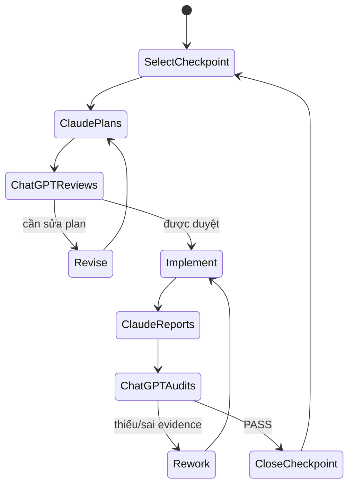

# 09 — Claude Workflow Guide

## 1. Mục tiêu workflow

ChatGPT chịu trách nhiệm planning/review; Claude chịu implementation; Product Owner kiểm soát phê duyệt và truyền artifacts giữa hai phiên. Workflow này ngăn scope creep, claim test không có evidence và thay đổi kiến trúc âm thầm.

## 2. Chu trình chuẩn



## 3. Gói đầu vào cho Claude

Mỗi checkpoint chỉ cần:

- checkpoint ID và mục tiêu;
- yêu cầu đọc `CLAUDE.md` + docs liên quan;
- trạng thái repo hiện tại;
- acceptance criteria của checkpoint;
- yêu cầu **plan only, no code changes**;
- yêu cầu liệt kê files/packages/commands/risks.

Không paste tất cả tài liệu vào prompt nếu Claude có repo. Chỉ dẫn Claude đọc source-of-truth files để giảm drift.

## 4. Gói plan gửi ChatGPT review

Product Owner gửi nguyên văn:

1. Plan của Claude.
2. Checkpoint ID.
3. Git evidence:
   - `git status --short`;
   - `git branch --show-current`;
   - `git log -1 --oneline`;
   - xác nhận feature branch được tạo từ `develop`;
   - `git diff --stat` hoặc `git diff develop...HEAD --stat` nếu đã có commit.

4. Repo tree liên quan nếu ChatGPT chưa có repo.
5. Package/version Claude đề xuất.
6. Blocker/câu hỏi Claude nêu.

ChatGPT review theo rubric:

| Nhóm         | Câu hỏi                                                                                    |
| ------------ | ------------------------------------------------------------------------------------------ |
| Scope        | Có đúng một checkpoint? Có lấn sang P1/P2 không?                                           |
| Architecture | Có giữ Host/MCP Server/Mock CRM/Chroma boundaries?                                         |
| MCP          | Có dùng official SDK, tool contract và stateless server?                                   |
| RAG          | Structured CRM và vector knowledge có bị trộn?                                             |
| Security     | PII/secrets/log/model output có control?                                                   |
| Testing      | Commands/assertions có đủ chứng minh acceptance?                                           |
| Change risk  | File/package/schema thay đổi có nhỏ và rollback được?                                      |
| Schedule     | Có khả thi trong timebox của checkpoint?                                                   |
| Git workflow | Có đúng `feature/p0-xx-*`, base là `develop` và không chứa thay đổi checkpoint khác không? |

Verdict plan:

- `APPROVED`
- `APPROVED WITH REQUIRED CHANGES`
- `REVISION REQUIRED`
- `BLOCKED — DECISION NEEDED`

## 5. Cách chuyển approval cho Claude

Product Owner phải nói rõ:

```text
Plan cho P0-XX đã được phê duyệt với các điều kiện sau: ...
Hãy implement đúng phạm vi này. Không bắt đầu checkpoint kế tiếp.
```

Nếu có required changes, paste nguyên văn. Không chỉ nói “ok làm đi” khi plan có nhiều phương án chưa chốt.

## 6. Progress check giữa checkpoint

Chỉ cần check giữa chừng khi:

- checkpoint kéo dài hơn dự kiến;
- Claude đề xuất đổi package/model/contract;
- lỗi SDK/transport;
- diff tăng rộng;
- test external service không ổn;
- Claude cần workaround chạm architecture.

Gói progress tối thiểu:

```text
Checkpoint / elapsed time:
Completed:
Current change:
Changed files:
Commands run + result:
Blocker:
Decision requested:
Remaining plan:
```

ChatGPT có thể yêu cầu dừng, thu nhỏ hoặc rollback riêng phần ngoài scope; Product Owner truyền lại quyết định.

## 7. Gói evidence cuối checkpoint

Claude phải cung cấp:

- completion report theo `CLAUDE.md`;
- `git status --short`;
- `git diff --stat`;
- `git branch --show-current`;
- `git log -1 --oneline`;
- `git diff develop...HEAD --stat` nếu checkpoint đã có commit;
- xác nhận branch chưa được merge trước khi reviewer đưa verdict;
- commit hash nếu Product Owner đã cho phép commit.
- diff đầy đủ hoặc repository/ZIP nếu ChatGPT cần code review;
- tất cả commands thực sự chạy và output tóm tắt/exit code;
- automated test names/results;
- manual steps và screenshot nếu là UI;
- config/package changes;
- known limitations;
- cập nhật đề xuất cho `CHECKPOINT_STATUS.md`.

Không cần gửi `bin/`, `obj/`, `.git/`, secrets, full runtime logs có PII hoặc API key.

## 8. ChatGPT checkpoint audit

Thứ tự audit:

1. So diff với plan đã duyệt.
2. Kiểm tra branch hiện tại đúng checkpoint, được tạo từ `develop` và không chứa thay đổi của checkpoint khác.
3. Kiểm tra decision invariants.
4. Map evidence vào từng acceptance criterion.
5. Phân biệt test đã chạy và test chỉ được đề xuất.
6. Kiểm tra lỗi/negative path, secret/PII và scope creep.
7. Trả verdict + required fixes + checkpoint tiếp theo (nếu PASS).

Nếu ChatGPT không có code/diff, verdict chỉ có thể là “review report-level”, không phải code audit hoàn chỉnh. Product Owner nên đính kèm repository hoặc patch cho các checkpoint P0-04, P0-05, P0-07 và P0-09.

## 9. Git branch, commit và merge workflow

### Branch hierarchy

```text
main
└── develop
    └── feature/p0-xx-<short-name>
- Claude không commit/push nếu chưa được yêu cầu.
- Sau verdict PASS, Product Owner có thể yêu cầu Claude chuẩn bị commit hoặc tự commit.
- Một checkpoint → một commit logic.
- Commit message gợi ý: `feat(p0-04): add core MCP tools`.
- Nếu checkpoint cần rework, sửa trong cùng branch trước commit.

## 10. Khi nào cập nhật tài liệu

| Thay đổi | File cần cập nhật |
| --- | --- |
| Decision/scope | `01_PROJECT_DECISIONS.md` |
| Component/data flow | `02_ARCHITECTURE.md` |
| Pass/fail expectation | `03_ACCEPTANCE_CRITERIA.md` |
| Checkpoint sequencing | `04_P0_CHECKPOINTS.md`, `05_IMPLEMENTATION_PLAN_9_DAYS.md` |
| DTO/endpoint/dataset | `06_DATA_AND_MOCK_API_SPEC.md` |
| MCP schema/tool | `07_MCP_TOOL_CONTRACTS.md` |
| RAG/model/dimension/PII | `08_RAG_EMAIL_AND_PII_SPEC.md` |
| Demo path | `11_DEMO_RUNBOOK.md` |
| Tiến độ/evidence | `CHECKPOINT_STATUS.md` |

Mọi doc change làm thay đổi quyết định phải được review trước implementation.

## 11. Cách dùng tài liệu LibraryRagChatbot cũ

Được tái sử dụng pattern:

- interface boundaries cho embedding/vector/chat;
- Gemini 768D + normalize;
- Chroma client/server;
- grounded citation/no-information fallback;
- config validation, cancellation, UTC, secret hygiene;
- checkpoint workflow.

Không copy nguyên domain model, persistence/retention, PostgreSQL schema hoặc ingestion assumptions của LibraryRagChatbot vào CRM Copilot.

```
